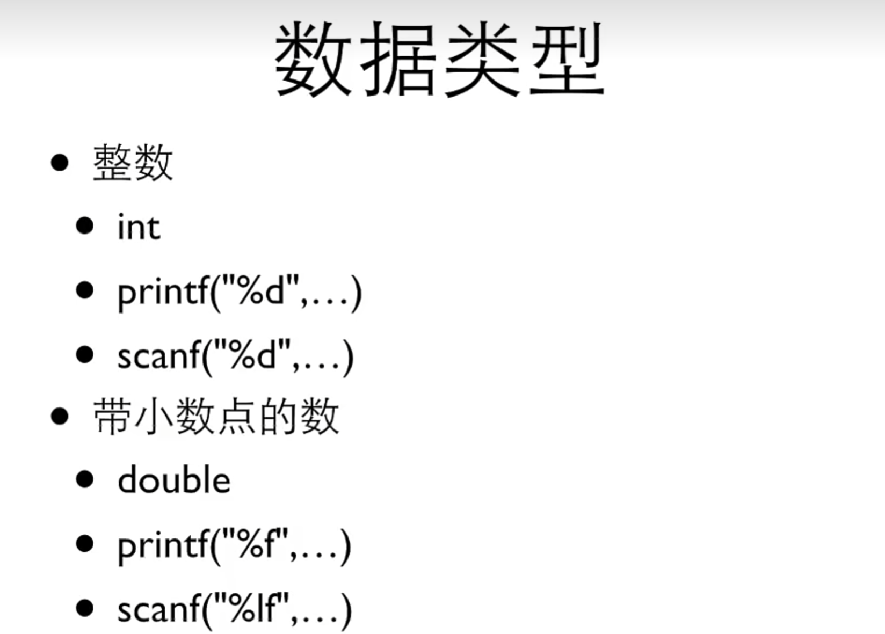

# <center>基础 

## 1.1 C程序的框架  
```
#include <stdio.h>

int main() {
    
    return 0;
}
```  
- 每个C程序都需要的必要框架

## 1.2 Hello world  
```
#include <stdio.h>

int main() {
    printf("Hello, World!\n");
    return 0;
}
```  

## 1.3 计算  
`printf("%d", 1+1);`
- %d：后面有一个整数要输出在这个位置  
##### 四则运算  
| 四则运算 | 符号 | 意义 |
| :---: | :---: | :---: |
| + | + | 加 |
| - | - | 减 |
| x | * | 乘 |
| ÷ | / | 除 |
| mod | % | 取余 |  

## 2.1 变量  
- 变量的定义：*类型名称* *变量名* = *初始化值*;
`int value = 0;`  
- 变量的意义：分配一个内存空间，指定其名字并赋值，而后可以进行调用（若未进行初始化，其值似乎是变量的内存空间地址？）  
- 变量的类型：
```
int a = 10;               // 整数
float pi = 3.14f;         // 单精度浮点数
double e = 2.71828;       // 双精度浮点数
char c = 'A';             // 字符
```

## 2.2 变量的输入  
`scanf("%d", &name);`  
- scanf()将读取到的**整数**赋给name  

`scanf("%lf, &name)`  
- scanf()将读取到的**浮点数**赋给name
#### 更多用法：

### ==注意&!!!==  
##### scanf()的更多用法详见[教程][教程1]  

## 2.3 常量  
`const int value = 0;`
- **const**是一个修饰符，表明该变量不能被修改（即常量） 

## 3.1 表达式  
表达式是一系列运算符和算子的组合，用来计算一个值  
- 运算符：指进行运算的动作（+-*/等）
- 算子：又名操作数，运算数，指参与运算的值（常数，变量，返回值等）


[教程1]:https://www.bilibili.com/video/BV1dr4y1n7vA/?spm_id_from=333.788.videopod.episodes&vd_source=ab3479e6b79dbfe7e220c2b22c17ce38&p=14