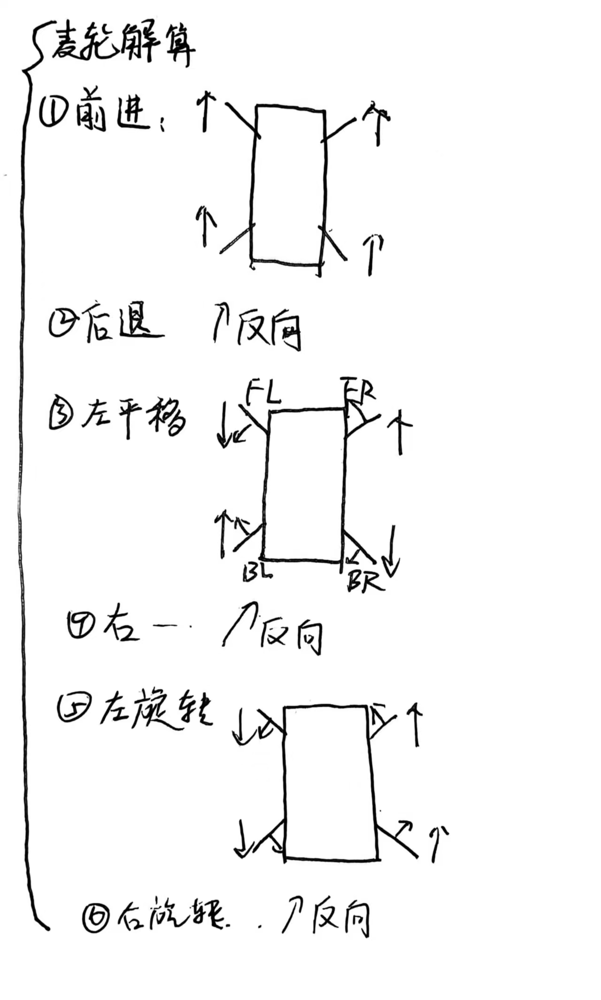

# 
麦克纳姆轮的解算与驱动

## 解算：
- **功能**：实现小车的前进、后退、左平移、右平移、左转、右转和停止
**麦轮解算图（简化）**[^1]

## 驱动：
- **功能**：实现麦克纳姆轮的方向与速度控制
- **设计思路**：
  - 方向控制：
    - 电路设计方面，采用了 GPIO 引脚来控制 L298N 的输入引脚。
    - 电机的方向是通过 GPIO 输出高低电平 来控制的，根据不同的组合实现电机的前进、后退、左平移、右平移、左转、右转等操作。

  - 速度控制：
    - 电路设计方面，采用 STM32 TIM1 定时器，配置为 PWM 模式，分别控制两个电机的速度。
    - 通过定时器生成的 PWM 信号来控制电机的速度，速度范围从 0 到 100%。摇杆的偏移量（0~127）映射为 PWM 占空比，从而实现速度的控制。

  - 代码调试与优化：
    - 在调试过程中，发现电机在切换方向时可能会产生振动，因此加入了延时和加减速控制，平滑过渡。
    - 为确保在摇杆微小输入时，电机依然能精确响应，增加了死区处理，防止摇杆的微小抖动导致不必要的电机运动。
- **开发历程**：
10/19 决定直接使用赛事组提供的L298N,TT马达，麦轮进行开发（有组员建议普通轮子即可，但已经采购完了）
10/20 完成了一个马达的驱动
10/24 完成了四个马达带动麦轮的驱动

[^1]: