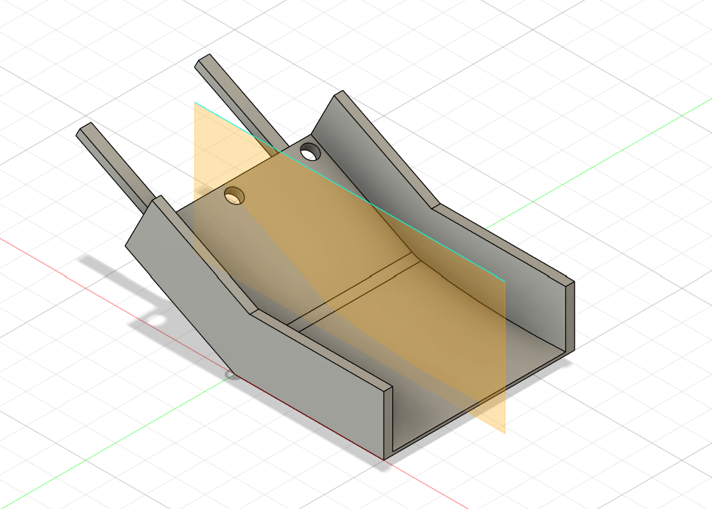
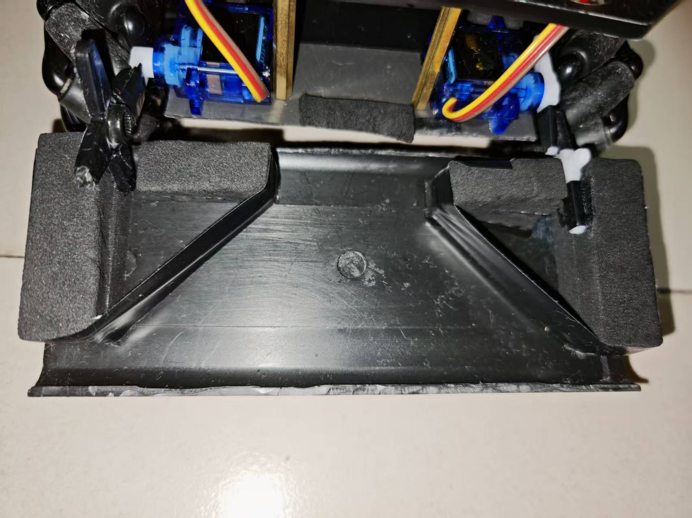
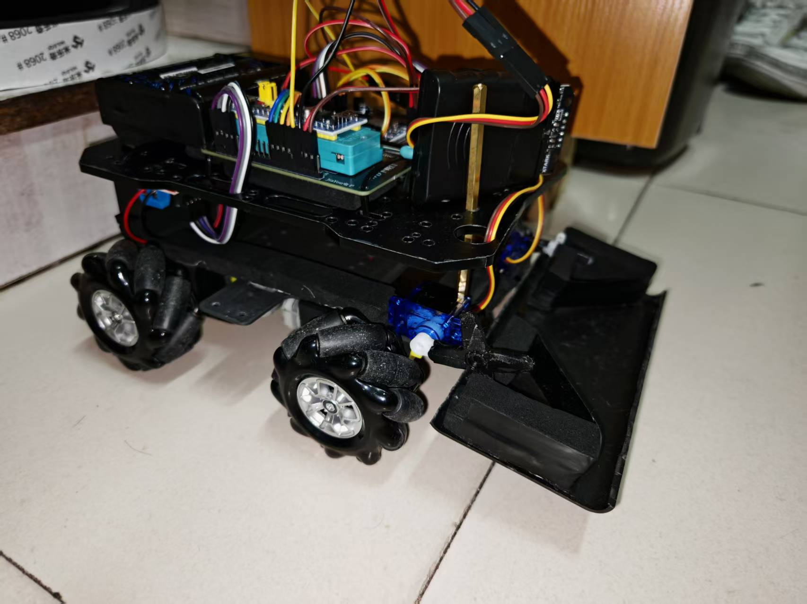

# 
弹丸携带（机械铲模块）

## 一、舵机控制模块
- **功能**：舵机控制模块用于控制 SG90 舵机 的角度。在我们的智能车中，舵机主要负责控制机械铲的转动，以达到收集小球的目的
- **设计思路**：通过 PWM 信号 来控制舵机的转动，PWM 的占空比控制舵机的旋转角度。
    - 在 STM32 上，通过 TIM2 定时器 配置为 PWM 模式，通过设置不同的占空比控制舵机的角度。舵机的角度范围从 0° 到 180°，对应 PWM 占空比从 1ms 到 2ms。
    - 我们实现了 正转和反转 功能，通过按下 PS2 手柄的 **△** 启动舵机正转（180°），按下 **X** 启动反转（0°）
- **开发历程**：
    - 功能调试与优化：
      在舵机调试时，首先确保舵机能够平稳地从 0° 转动到 180°，并且转动时不会产生卡顿。
    - 进一步改进：
      - 对舵机进行降速，增加了舵机角度控制的平滑性，避免了急剧的角度跳跃导致的小球脱出。
      - 通过加入适当的延时，使舵机在运动过程中更加稳定。
      - 进行角度限制，避免过度旋转导致小球脱出轨道

## 二、机械铲（废案）
- **功能**:在我们的智能车中，机械铲将承担起拾取和收集小球的功能。
- **设计思路**：通过后端与舵机相连实现机械铲的抬起与降落。设计机械铲的外观，在铲起小球的过程中，使小球尽量顺利的落入收集装置中。
     - 在整个铲子后端伸出两个扁平的棍子与舵机重叠、相连，实现整个铲子的机械转动。这一结构为灵活收集各个地方的小球的前提条件。
     - 机械铲整体外形：铲子整体宽64mm,前端轻度内凹，形成光滑的曲面。后端与水平面重合时，前端与水平面呈大约30°的夹角。此结构可以让小球顺利进入铲子后端的收集装置。两边有高为17mm的屏障预防小球冲出机械铲。
- **开发历程**:
  
    - 方案确定：
       
       在最开始我们对机械臂抓取小球的设计提出了两个方案。

       **方案一是正常的机械爪**（如图） 
       
       

       或者是稍显粗糙的机械爪（如图）
       
       
       
       虽然外形不一样，但本质上都是通过“夹取”这一行为拾起小球。在这一本质下，如果想要提高拾取小球的速度，对于机械爪的精度要求高，例如：爪子设置成多长才能完全包裹住小球；爪子与舵机如何连接可以增强灵活度，使其在面对小球卡在角落的情况时，能顺利抓住小球。除以上问题，3D打印正常的机械爪会增加更多的支撑，打印失败的概率很大。最后电控组的反馈也促使我们放弃这个方案。

       **方案二我们提出了机械铲**这个模型，如图是我们最开始的示意图。
       机械铲的本质是“铲起”这一行为。所以大面积的平面有利于一次铲起更多的小球，提高效率。其次在3D打印这一环节，只需要在前端底部设置支撑，这大大的降低了打印难度。最后电控组的压力也会减轻许多。所以我们敲定了此方案。
    - 机械铲具体设计
      - 最初设计时，我想在铲子后端表面增加凹槽来增大摩擦，以减缓小球的速度，使其精准落入收集装置。因为小球直径17mm，经过计算后凹槽6mm宽最为合适，铲子厚度3mm时硬性比较好。如图：

      

      - 但是后来经过机械组的讨论，认为如果在机械铲两侧 加上挡板那么就不必如此复杂，毕竟，对于新手凹槽在打印的时候也容易出现问题。所以我们去掉了这个比较“鸡肋”的功能。
      经过大家的集中讨论，我们将铲子两侧增加了高17mm，厚3mm的挡板。并且把铲子前端底面设计为轻微曲面，以便小球“顺坡下驴”。但是这里出现了一个问题：由于曲面过于轻微，前端的厚度很薄，后期打印的时候会很不容易。所以我们把曲面增加了0.5mm的厚度。
      机械铲的主体设计完成了，我们在后端延伸出两条扁平的棍子与舵机相连。在这里我们考虑到如果用“榫卯”式的连接需要连接处与舵机齿纹完全重合，需要的精度很大，遂放弃；又想用螺丝钉连接二者，但是钉子型号不太好找，于是备用；最后我们认为把棍子和舵机直接用502相连既简单又牢固。
      最后我们在机械铲的后端打了3个等距的孔以安装收集装置（布袋）。所以，最终设计如图：

      

## 三、弹丸装载模块
- 设计思路：由于我们独特的机械铲设计，我们决定直接采用底盘与顶盘间的大量空间作为装载模块，元件连接在顶盘上，底盘空间封死，用于盛装小球

## 四、机械铲（实装）
- **大致功能及思路同上，只是对铲体进行更换（拓宽并缩短）**
- **如图**：

- **为什么要修改？**
因为在实际打印出机械铲后，实装表现并不好，因此，我们对方案进行了临时修改，改用前部的**拓宽型机械铲**进行收集

## 总结：
经过了三轮方案选型及迭代优化，我们终于敲定了最终弹丸携带模块的设计，做出了如下图所示的一号车：
