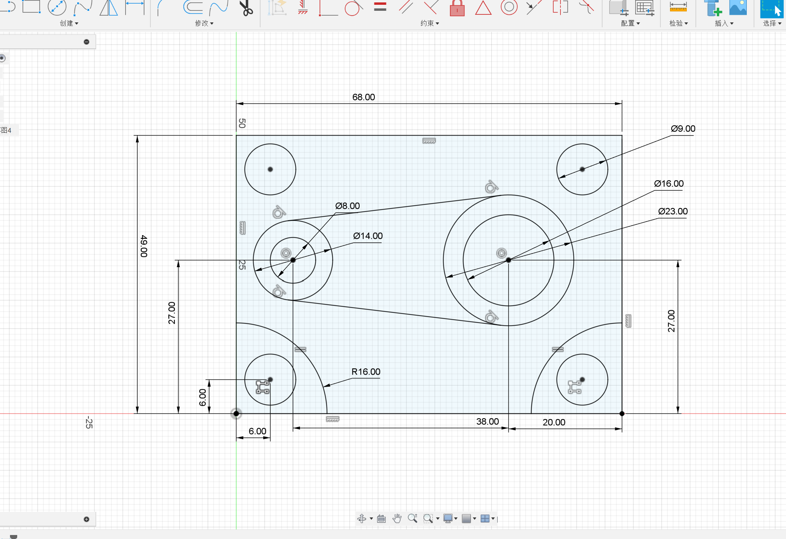

# 基础
## 关于Fusion草图指令
此系列笔记是按照我学习3D建模的指令顺序和练习顺序而编写的。
### 直线(快捷方式l)
通常用来勾勒草图轮廓或建立构造线。但是需要注意的是**直线（或者线段）之间的相对关系，如平行、垂直和共线等需要添加对应的约束。**
### 圆（快捷方式c）
**注意此处的快捷方式是只有中心直径圆**。还可以通过两点、三点、两切线和三切线来定义一个圆。一般两点和三点画圆是应用于与某处相连。两切线和三切线是与直线相切，如果运用在矩形里面画相切圆的场景效率会提高。
### 矩形（快捷方式r）
同样的这里的快捷方式只是**两点矩形**的。还有三点矩形和中心矩形，个人认为三点矩形的自由度是最高的。***注意：当标注长和宽时，调整容易出问题，此时直接在键盘上选TAB可以直接跳转到另一条边。***
### 圆角、剪切、约束和标注
都是选择自己需要运用的线条或点，直接点击即可。
### 对“草图的尺寸”有感
在画某些草图时，总是容易在调整某一尺寸时，草图突然“畸形”。这是因为在开始落笔第一条直线时，没有重视平面坐标提示的长度，随心所欲的画。这会让我们画的草图往标准草图靠拢时出现比例很大程度上的不协调。我认为这是新手很容易出现的问题。
 
 ***解决这个问题，我也有自己的一些小经验：***
1.在画之前根据坐标的长度估量草图的尺寸，主要是像矩形这种一般作为外框架的尺寸。
2.也可以在作画过程边标注边调整其他线条，使整个草图接近标准草图。
这个方法出自我在学画下面这个草图总结的：

以及我还有没有注意构造线，急于使用镜像，导致图形不对称的错误图纸

还有一些比较“畸形的图纸”没有及时截图，但是当时也是很搞心态，考验耐心。**所以，一些刚开始比较难的事情需要寻找方法，正确的方法论和足够的探索会提高效率，解决一类问题。**
### 草图练习
接下来是比较基础的草图练习展示：
第一张学会了一个**矩形列阵**，非常的方便，省去很多重复性工作。

第二张则是对于**环形列阵**的学习应用。

