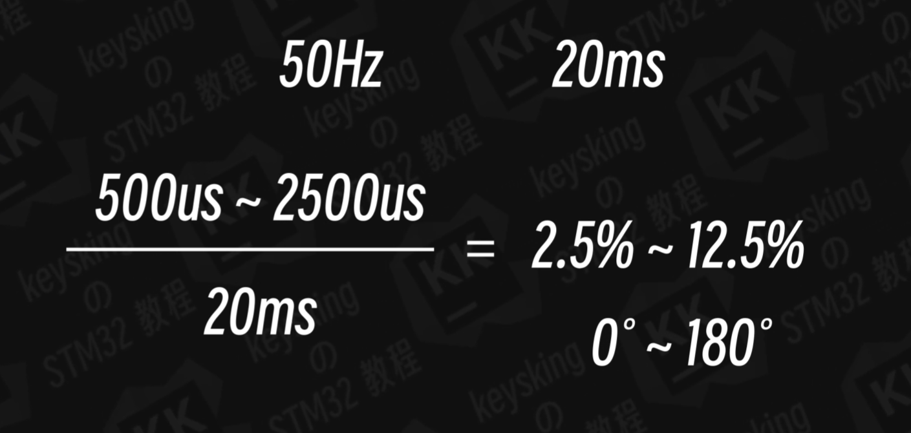

# <center>舵机
### 舵机需要特定的 PWM 信号才能工作，其三个关键参数：
- **PWM 频率**：必须是50Hz（即周期 20ms），这是绝大多数舵机的标准。
- **脉宽**与角度对应：
脉宽 0.5ms → 对应 0°
脉宽 1.5ms → 对应 90°（中间位置）
脉宽 2.5ms → 对应 180°
（不同舵机可能有细微差异，后续可校准）

- **供电**：舵机需要 5V 电源（电流可能较大，100~300mA），不能直接用 STM32 的 3.3V 引脚供电，否则会烧坏单片机或舵机！（似乎可以？）

### 硬件连接（接线示意图）
SG90 舵机：
|舵机引脚|连接到 STM32F103C8T6|说明|
|:---:|:---:|:---:|
|棕色线（GND）|单片机 GND 引脚	|共地，必须连接|
|红色线（VCC）|外部 5V 电源（如 USB5V）|不能接 STM32 的 3.3V！|
|橙色线（信号线）|任意 PWM 输出引脚（如 PA0）|接定时器的 PWM 通道|

- 注意：如果没有外部电源，可暂时用 USB 转 TTL 模块的 5V 给舵机供电（但不要长时间大角度转动）。

### CubeMX 配置（生成 PWM 信号）
**目标**：用定时器生成 50Hz 的 PWM，步骤如下：
- **步骤 1**：选择定时器和 PWM 通道
STM32F103C8T6 的通用定时器（TIM2~TIM5）都支持 PWM，以TIM2_CH1（PA0 引脚） 为例：
打开 CubeMX 工程，左侧 “Timers”→“TIM2”，模式选择 “PWM Generation CH1”。
- **步骤 2**：配置定时器参数（核心！）
根据 50Hz 频率计算 PSC 和 ARR：
定时器时钟频率：STM32F103 的定时器时钟为 72MHz（前面讲过）。
50Hz 对应的周期是 20ms = 20000μs。
    - **公式**：
```
周期 = (PSC + 1) × (ARR + 1) ÷ 72,000,000（Hz）
20000μs = (PSC + 1) × (ARR + 1) ÷ 72,000,000
→ (PSC + 1) × (ARR + 1) = 72,000,000 × 0.02 = 1,440,000
```  


- - **简单配置**：
    - Prescaler (PSC)：填719（则 PSC+1=720）
    - Counter Period (ARR)：填1999（则 ARR+1=2000）

    验证：720 × 2000 = 1,440,000，刚好满足，此时 PWM 频率 = 50Hz。

- **步骤 3**：确认 PWM 引脚
引脚图中 PA0 会显示 “TIM2_CH1”，无需修改 GPIO 设置（CubeMX 自动配置为 PWM 输出）。

- **步骤 4**：生成代码
点击 “Project Manager” 生成代码，确保MX_TIM2_Init()函数正确生成。

### 代码实现（控制舵机角度）
生成代码后，只需在main.c中添加两个关键操作：启动 PWM、设置角度对应的脉宽。
- **步骤 1**：启动 PWM 输出
在main()函数的初始化后，添加启动代码：
```
// 启动TIM2的CH1通道PWM输出
HAL_TIM_PWM_Start(&htim2, TIM_CHANNEL_1);
```
- **步骤 2**：编写角度控制函数
```
根据 “脉宽 - 角度” 对应关系，计算比较值（CCR）：
定时器计数周期是 20ms（ARR=1999），每个计数单位的时间 = 20ms ÷ 2000 = 10μs。
脉宽 0.5ms=500μs → 比较值 = 500÷10=50
脉宽 1.5ms=1500μs → 比较值 = 1500÷10=150
脉宽 2.5ms=2500μs → 比较值 = 2500÷10=250
因此，0° 对应 50，90° 对应 150，180° 对应 250。
```
- 添加函数将角度转换为比较值：
```
// 角度范围：0~180度
void Servo_SetAngle(uint8_t angle) {
  // 限制角度范围（防止舵机损坏）
  if (angle > 180) angle = 180;
  
  // 计算比较值：从角度映射到50~250
  uint16_t ccr = 50 + (250 - 50) * angle / 180;
  
  // 设置PWM比较值（占空比）
  __HAL_TIM_SET_COMPARE(&htim2, TIM_CHANNEL_1, ccr);
}
```
- **步骤 3**：测试舵机转动
在main()的 while 循环中调用函数，让舵机转动：
```
while (1) {
  Servo_SetAngle(0);    // 转到0°
  HAL_Delay(1000);      // 等待1秒
  
  Servo_SetAngle(90);   // 转到90°
  HAL_Delay(1000);
  
  Servo_SetAngle(180);  // 转到180°
  HAL_Delay(1000);
}
```

### 常见问题
**舵机没反应？**
检查接线：GND 是否共地，信号线是否接对 PWM 引脚（PA0）。
检查电源：必须接 5V，且功率足够（用外部电源试试）。
检查代码：是否调用了HAL_TIM_PWM_Start()启动 PWM。
角度不准？
微调Servo_SetAngle函数中的 50 和 250（比如舵机 0° 对应 55，则改 50 为 55）。
原因：不同舵机的脉宽范围可能有差异，需手动校准。
